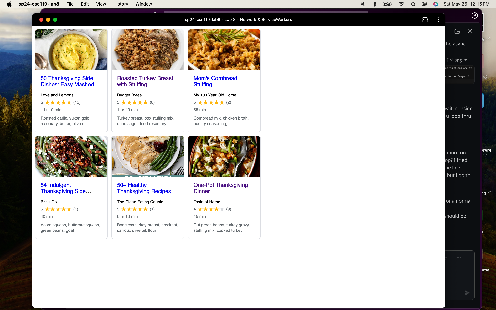

# Lab 8

Allison Lane

Adding service workers is a form of graceful degredation. 
It allows an application to retain functionality without a network connection, therefore maintaining its functionality in a less connected or capable environment.

